<h1>
  

    👋 Hi there! My name is Hieu Duong.
  

  
  

    
  

</h1>

## 👋 About Me

## 📈 GitHub Stats

<!--

  
  

-->

  

  
  

<!--

  
  

-->

  <picture>
    <source media="(prefers-color-scheme: dark)" srcset="https://raw.githubusercontent.com/duonghieu0712z/duonghieu0712z/output/github-snake-dark.svg">
    <source media="(prefers-color-scheme: light)" srcset="https://raw.githubusercontent.com/duonghieu0712z/duonghieu0712z/output/github-snake.svg">
    
  </picture>

